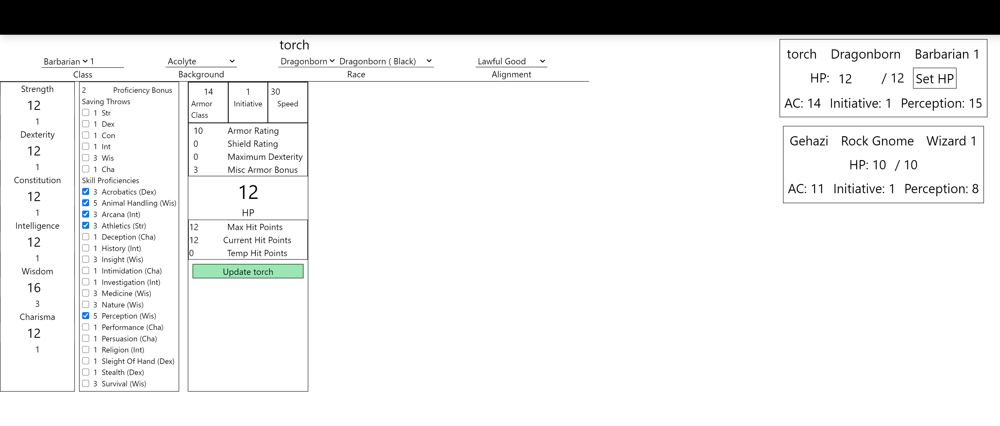

# Dungeons & Dragons Session Helper

## Who made this project?

I did!

## What is this project for?
This project was created to for Dungeons & Dragons 5th Edition players and game masters to track character sheets and have visible, live player stats that everyone can see.

## Why did I make this project?

This is a personal project I plan on using with friends. It is a work in progress and there is much more that needs to be done before I call this project finished.

### Future Updates

There are many updates planned for this application:
* Improve stability
* Fix known rendering issues
* Create more robust character building
* Implement search bar using dnd5e api
* Add item tracking
* Add spell tracking and automatic DC calculations
* Allow players to search for items, spells, etc... and add directly to correct list
* Add ability to make and manage rooms so anyone can use this application

### JSYK

This project is open source. Anyone may contribute to this project. You may clone or fork this repository for your own personal use but you may NOT claim this as your own work or post the active site without my permission.
